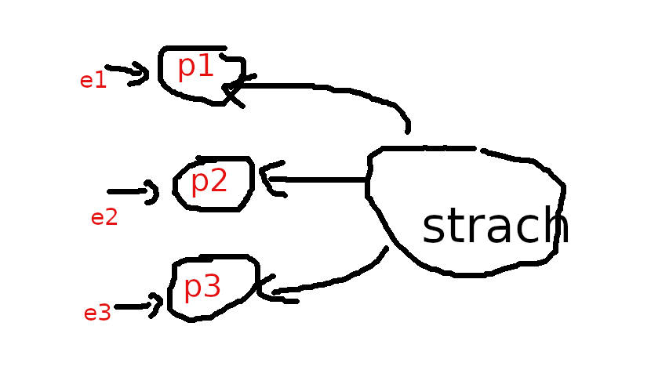

```{r setup, include=FALSE}
knitr::opts_chunk$set(echo = TRUE)
```

## Pomiar ankietowy

Ankieta gromadzi dane dotyczące:

* **Faktów** (wiek, staż, zawód, tętno, przebyte choroby)

* **Przekonań**, **Wartości**, **Postaw**; 
  **Uczuć** (strach / radość) albo **Zamiarów**
  (w języku   Attitudes/Emotions/Intentions)

**Przekonanie** to idea, którą jednostka uważa 
za prawdziwą. **Wartości** to trwałe przekonania o tym, 
co jest ważne dla jednostki.  Stają się standardami, według których jednostki dokonują wyborów.
**Postawy** to mentalne dyspozycje/nastawienie 
przed podjęciem decyzji, które skutkują 
określonym zachowaniem (zrobię to a nie tamto). Postawy 
kształtowane są wartościami i przekonaniami.

Przykład ankiety (do wypełnienia):
https://docs.google.com/forms/d/e/1FAIpQLSe978MLywUaAomO8BmD1_VsXdOzbV5cVtiIqbFQhurhtxFQKQ/viewform?usp=sf_link


## Pomiar przekonań, wartości i postaw

Postawy/uczucia/zamiary są to pojęcia
abstrakcyjne. Często (albo zawsze) definiowane w obszarze psychologii.

Ich pomiar jest dokonywany w specyficzny sposób.
**Definicja koncepcyjna** definiuje pojęcie 
(zaufanie do kogoś/czegoś to **przekonanie**, że 
*działania tego kogoś/czegoś okażą się zgodne z naszymi
oczekiwaniami*; satysfakcja to
**uczucie** *przyjemności, zadowolenia z czegoś*;
samoskuteczność to 
**przekonanie**, iż *jest się w stanie zrealizować określone działanie lub osiągnąć wyznaczone cele*).
**Definicja operacyjna** określa jak zmierzyć pojęcie
(jak zmierzyć satysfakcję)
Przejście od DK do DO bywa 
czasami mocno, hmm... arbitralne.


## Skala Likerta

Przykładowo chcemy się dowiedzieć czy i jak bardzo respondenci boją się COVID19. 

W najprostszej wersji się po prostu pytamy: 
**Czy pan/pani boi się COVID19?** i dajemy 
respondentowi trzy możliwe 
warianty odpowiedzi: Tak/Nie/Nie wiem. 

Może też być pięć wariantów: bardzo się boję--boję się--ani/ani--nie boję się--zupełnie się nie boję.

Taką skalę pomiarową określamy jako **porządkową**. 
Wartości na tej skali nie są liczbami, ale są uporządkowane; można
im zatem przypisać **rangi**, czyli liczby określające pozycję
w uporządkowanym szeregu wartości (np 1--5 w drugim przykładzie.)
Tego typu skala pomiarowa, typowa dla ankiet, nosi nazwę skali **Likerta**.
Można wymyślać skalę Likerta 7-punktową, 9-punktową i więcej. 

IMO: powyżej 7 wariantów normalny respondent będzie miał problem 
czy się bardziej-bardziej 
czy bardziej-bardziej-bardziej
boi.

## Skala pomiarowa/inwentarz/kwestionariusz

Ponieważ skala Likerta jest zgruba, to 
uważa się powszechnie, że lepszy wynik da pomiar 
wielokrotny. 
W naukach podstawowych mierzymy (np. linijką) parę razy, a wynik uśredniamy co daje pomiar bardziej precyzyjny. 
W badaniach ankietowych pytamy się **parę razy o to samo**, co
ma dać podobny efekt (mniejszy średni błąd pomiaru). 
Taka seria pytań nosi też nazwę **skali** albo **inwentarza**.

Nie pytamy się zatem **Czy pan/pani boi się COVID19?** tylko zadajemy serię
pytań o strach względem COVID19. 


1. I am most afraid of Corona

2. It makes me uncomfortable to think about Corona

3. My hands become clammy when I think about Corona

4. I am afraid of losing my life because of Corona

5. When I watch news and stories about Corona on social media, I become nervous or anxious.

6. I cannot sleep because I’m worrying about getting Corona.

7. My heart races or palpitates when I think about getting Corona

albo:

1. Boję się koronawirusa

2. Czuję dyskomfort, gdy myślę o koronawirusie

3. Pocą mi się dłonie, gdy myślę o koronawirusie

4. Boję się, że mogę stracić życie z powodu koronawirusa

5. Gdy oglądam wiadomości i czytam o koronawirusie w mediach
    społecznościowych, robię się nerwowy i niespokojny

6. Nie mogę spać, ponieważ martwię się, że ja lub moi bliscy zarażą się

7. Dostaję palpitacji serca, gdy myślę o tym, że mógłbym się zarazić.

**Odpowiedzi**: 
1 = zdecydowanie nie; 2 = nie; 3 = ani tak ani nie; 4 = tak; 5 = zdecydowanie tak. Suma ma wartość minimalną 7 a maksymalną 35.


The Fear of COVID-19 Scale: Development and Initial Validation. 
International Journal of
Mental Health and Addiction, 1–9. 
https://www.ncbi.nlm.nih.gov/pmc/articles/PMC7100496/

*Fear of COVID-19 Scale (FCV-19S) across countries: Measurement invariance issues*
https://onlinelibrary.wiley.com/doi/10.1002/nop2.855

*Fear of COVID-19, psychological distress, work satisfaction and turnover 
intention among frontline nurses*
https://onlinelibrary.wiley.com/doi/full/10.1111/jonm.13168

Lęk przed koronawirusem COVID-19
i lęk przed śmiercią – polskie adaptacje narzędzi
https://www.termedia.pl/Fear-of-COVID-19-and-death-anxiety-Polish-adaptations-of-scales,116,44937,1,1.html

## Model pomiaru

Ukryty czynnik (strach) kształtuje wartości indykatorów (odpowiedzi na pytania)
Taki sposób pomiaru **ukrytego czynnika** (latent w języku angielskim) 
określa się mianem refleksyjnego (co jest kalką od *reflexive*)

 


Alternatywny sposób definiowania ukrytego (w pewnym sensie, bo raczej złożonego a nie ukrytego per se) czynnika nosi nazwę **formatywnego** 
(albo indeksu): czynnik jest sumą indykatorów.
Przykładem może być SES: 
status socjo-ekonomiczny będący agregatem wykształcenia, dochodu i zawodu.

W założeniu indykatory są jednakowo dobrymi miarami
czynnika refleksyjnego i jako takie powinny być mocno
skorelowane (mierzą to samo). 
Natomiast składniki czynnika formatywnego nie powinny
być skorelowane, raczej każdy powinien mierzyć **inny
aspekt** czynnika. Ktoś może być profesorem 
za przeproszeniem filozofii, nie mieć pracy i kiepskie
dochody. 
Tylko jeden z trzech aspektów podwyższa mu SES;
albo świetnie zarabiająca prostytutka bez matury....

W najprostszym podejściu czynnik ukryty 
(refleksyjny/formatywny) mierzymy sumując wartości indykatorów.
Wartości indykatorów nie analizujemy indywidualnie, bo indywidualny
indykator nie ma interpretacji...


## Zalecany schemat analizy statystycznej

Przykładowa ankieta  zawiera pytania dotyczące faktów 
w skali nominalnej (płeć, kontakt z zarażonymi na COVID19),
porządkowej (wielkość firmy)
oraz ilorazowej (wiek) **oraz** pytania dotyczące
postaw mierzone za pomocą skal/inwetarzy składających się wielu pytań
mierzonych w skali Likerta (strach = 7 pytań + samoskuteczność = 10 pytań).

Zatem ankieta zawiera następujące zmienne: 
**staż**, **kontakt**, **płeć**, **firma-wielkość**, **strach**, **samoskuteczność**

Link do ankiety:
https://docs.google.com/forms/d/e/1FAIpQLSe978MLywUaAomO8BmD1_VsXdOzbV5cVtiIqbFQhurhtxFQKQ/viewform?usp=sf_link

### Schemat analizy

* indykatory mierzące postawy przekodowujemy na stosowne rangi; sumujemy
rangi. Wartością zmiennej jest suma rang. Tylko tę wartość wykorzystujemy
do analiz.

### Analiza struktury 

* fakty wyrażone w skali nominalnej/porządkowej (płeć); wykres słupkowy + tablica udziałów czyli procentów; porównanie w grupach: wykres słupkowy + procenty

* fakty wyrażone w skali liczbowej (wiek); wykres histogram albo
tablica + miary
średnie, rozproszenia, asymetrii; porównanie w grupach:
wykres pudełkowy (jak ktoś umie) lub wykres słupkowy +
zestawienia miar średnich/rozproszenia

* postawy, jak fakty wyrażone w skali liczbowej po zsumowaniu
wartości indykatorów

### Analiza zależności/korelacji pomiędzy dwoma zmiennymi (faktami lub postawami)

* obie wyrażone w skali nominalnej/porządkowej: 
 tablica wielodzielna + test chi-kwadrat niezależności

* jedna w skali nominalnej/porządkowej druga liczbowa (strach wg płci): 
zmień liczbową na nominalną/porządkową, zastosuj test chi-kwadrat. 
Przykładowo:
zamiana skali liczbowej strachu na nominalną: mały (7--14), 
średni (15--21), duży (22--29), bardzo duży (30--35)

* obie wyrażone w skali porządkowej lub liczbowej (strach względem stażu):
wykres rozrzutu (wykres XY) +
współczynnik korelacji liniowej Pearsona + regresja liniowa.

## Szczegółowy opis analizy

struktura wg stażu, kontaktu, płci, wielkości-firmy, 

struktura wg strachu, samoskuteczności

struktura wg grup: strach wg stażu/kontaktu/płci/wielkości firmy;
samoskuteczność wg stażu/kontaktu/płci/wielkości firmy.
Uwaga staż przekodować na młodych/starych (np 1--4 młodzi, 5 i więcej starzy)

zależność/korelacja: między stażem/kontaktem/płcią/wielkością firmy
a strachem (przekodowanym na skalę porządkową) -- test chi kwadrat

zależność/korelacja: między wielkością firmy a strachem -- współczynik rang.

zależność/korelacja: między stażem a strachem -- 
współczynik korelacji Pearsona.

zależność/korelacja: między samoskutecznością a strachem -- współczynik korelacji Pearsona.

zależność/korelacja: między stażem, samoskutecznością a strachem --  regresja liniowa (wypróbować różne kombinacje zmiennych).

## Zadanie do wykonania (na zaliczenie)

Opracować ankietę objętościowo podobną do 
przykładowej (8 zmiennych/20 pytań); nie ma obowiązku mierzenia/badania
postaw, ale będzie to traktowane jako plus :-)
Zalecany program: google forms

Wykonać analizę kierując się wskazówkami z tego dokumentu. Zalecany program
LibreOffice lub google docs

Przygotować **raport** w edytorze biurowym. Sam arkusz to za mało.
Zalecany program: LiberOffice lub google docs

W razie wątpliwości proszę o kontakt mejlowy. Analiza kompletnie różna
od podanego przykładu w tym a zwłaszcza zawierająca nieomawiane na zajęciach
metody statystyczne będzie traktowana jako praca niesamodzielna...

Raport **proszę wydrukować** oraz wysłać emailem. Resztę tj. dane lub
link do ankiety w Google docs + arkusz z obliczeniami tylko dosłać emailem.
**Nie drukować**.